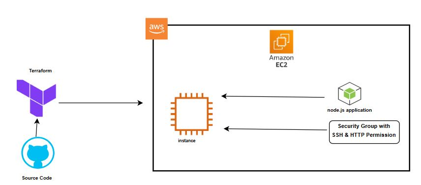

# Simple Node Application with Terraform and AWS 🚀

A simple Node.js application deployed on an AWS EC2 instance using Terraform.

---

## 📋 Table of Contents
- [Introduction](#-introduction)
- [Architecture Overview](#-architecture-overview)
- [Setup Instructions](#️-setup-instructions)
  - [Pre-requisites](#pre-requisites)
  - [Provisioning the Infrastructure](#provisioning-the-infrastructure)
- [Resources](#-resources)
  - [Detailed Articles](#detailed-articles)
- [Support](#Support)
- [License](#license)

---

## ✨ Introduction
This project demonstrates deploying a simple Node.js application on an AWS EC2 instance using Terraform for infrastructure as code (IaC).

### Features:
- Infrastructure provisioning with Terraform.
- Amazon Linux 2 AMI setup with Node.js and Git.
- Secure SSH and HTTP configurations with AWS Security Groups.

---

## 🏗 Architecture Overview
The architecture is designed as follows:



### Key Components:
- **Terraform**: To define and provision the AWS infrastructure.  
- **AWS EC2**: Hosts the Node.js application.  
- **AWS Security Groups**: Ensures secure access via SSH and HTTP.  

---

## ⚙️ Setup Instructions

### Pre-requisites
Ensure you have the following installed:
- **Terraform** (v1.5 or above)  
- **AWS CLI**  
- **Git**  

You also need:
- An AWS account.  
- An SSH key pair for accessing the EC2 instance.  

---

### Provisioning the Infrastructure

1. Fork and clone this repository:

```bash
git clone https://github.com/your-github-username/simple-node-application.git
cd simple-node-application/terraform
```

2. Set Environment Variables
Export your AWS credentials and SSH key:

```bash
export TF_VAR_aws_access_key="your-access-key"
export TF_VAR_aws_secret_key="your-secret-key"
export TF_VAR_key_name="your-ssh-key"
```

3. Update the Terraform Configuration

- Modify the ami value in main.tf to match your desired Amazon Linux 2 AMI.
- Replace the GitHub URL in user_data with your forked repository URL.

4. Initialize Terraform

```bash
terraform init
```

5. Inspect the Plan

```bash
terraform plan
```

6. Apply the Configuration:

```bash
terraform apply
```

7. Access the Application

- Note the EC2 instance's public IP address from the Terraform output.
- Open a browser and navigate to http://<instance-public-ip>:3000 to access the app.

## 📚 Resources

### Detailed Articles

1. [Deploying a Node.js Application with Terraform and AWS](https://durojayeolusegun.medium.com/deploying-a-simple-node-js-application-to-aws-ec2-using-terraform-a-beginners-guide-b58e7e11469c)

2. [Install Terraform](https://developer.hashicorp.com/terraform/install)

## Support 🙏😃
  
 If you Like the tutorial and you want to support my channel so I will keep releasing amzing content that will turn you to a desirable Cloud Engineer with Amazing Cloud skills... I will realy appricite if you:
 
 1. Subscribe to My youtube channel and leave a comment: https://www.youtube.com/@rising_segun
 2. Buy me A coffee ❤️ : https://www.buymeacoffee.com/durojayeolusegun

Thanks for your support :)

<a href="https://www.buymeacoffee.com/durojayeolusegun"></a>
